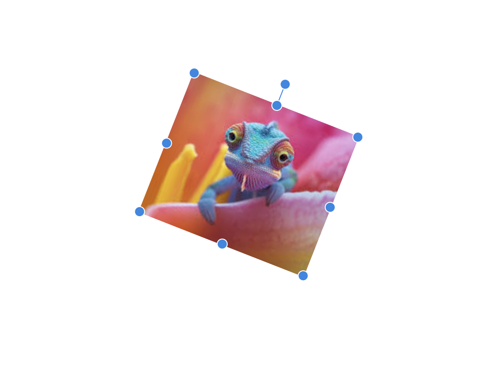

# Ostin UI
## Free Effects and without unnecessary rerenders

Ostin UI provides a range of interactive UI components that enable users to resize, move, and rotate elements on a web page. These components are designed to be highly customizable and accessible, making it easy to create engaging and interactive user experiences.

### Hooks:
- use-move
- use-resizable
- use-rotate
